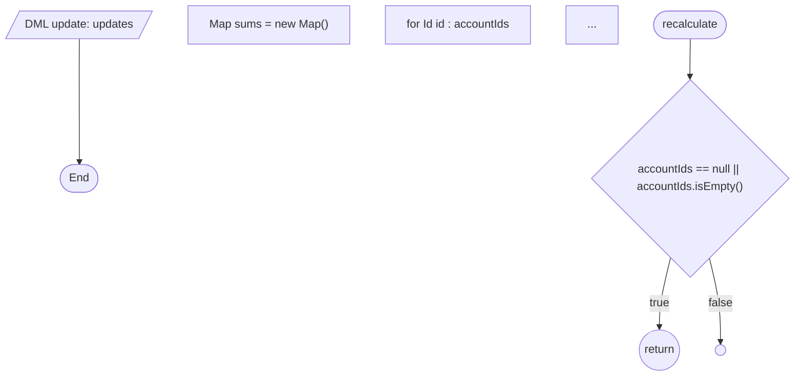

# Phase 8 完了宣言

## 判断

Phase 8 (B + A ハイブリッド) を完了。処理ロジックそのものを 2 つの経路から可視化した:

- **B (決定的)**: regex + brace counting で **Apex メソッド本体の制御フロー**と **Flow の decision 分岐**を抽出し、メソッド単位 / Flow 単位の Mermaid フローチャートとして Markdown に埋め込む
- **A (LLM)**: `/sfai-explain` slash command + `sfai explain-write` CLI で、AI_MANAGED ブロックを自然言語で安全に上書きする経路を確立

両者は完全に分離: B は乱数も時刻も使わず再現性 100%、A は AI_MANAGED ブロックだけに触れ、HUMAN_MANAGED と DETERMINISTIC を一切壊さない。

## 達成内容

| Sub | 取り組み | アウトプット |
|---|---|---|
| 8-B1 | Apex メソッド本体の制御フロー抽出 | `extractMethodControlFlows(content)` — if / else / for / while / try / catch / finally / return / throw / SOQL / DML を再帰的に解析 |
| 8-B2 | メソッド単位 Mermaid 生成 | `buildMethodFlowchart(flow)` — 1 メソッド 1 枚の `flowchart TD`、return/throw 以降は到達不能として描かない |
| 8-B3 | Flow decision 分岐の Mermaid 展開 | `extractFlowBody` を拡張し `edges`(connector / rule / default / fault / loop) を抽出。`buildFlowFlowchart(body)` が start → 各要素 → 分岐 を有向グラフとして描く |
| 8-B4 | sfai-trial で実機検証 | 20 Apex クラス / 1 Flow / 2 Trigger 全件で Mermaid が壊れず、try/catch + nested if + for ループも正しく描ける |
| 8-A1 | `/sfai-explain` slash command | `.claude/commands/sfai-explain.md` を新設。AI_MANAGED 以外を変更しない厳守ルールを明記、`sfai explain-write` を必ず経由する |
| 8-A2 | `sfai explain-write` CLI | `src/explain/index.ts` の `applyExplain` をラップ。マーカー数の不変条件を実行時にチェック (改竄を拒否) |
| 8-A3 | sfai-trial で実機検証 | `AccountBalanceService` と `OrderTrigger` で 2 つの AI_MANAGED ブロックを書き換え、後続 `sfai sync` で保全されることを確認 |

## merge 仕様の更新 (重要)

Phase 1 の ADR では「AI_MANAGED は再描画で上書きされる」としていたが、Phase 8 で **「AI_MANAGED が customized なら保全する」** に更新した。

| ブロック種別 | sync 時の挙動 (Phase 8 以降) |
|---|---|
| DETERMINISTIC | **常にテンプレで上書き** |
| AI_MANAGED | 既存内容がテンプレ既定値と一致 → 上書き / **異なれば保全** |
| HUMAN_MANAGED | **常に保全** |

これにより `/sfai-explain` の出力が `sfai sync` を超えて persistant になる。golden test (case-2) も新しい仕様に合わせて更新済。

## sfai-trial での実機検証結果

### B 系 (制御フロー Mermaid)

`AccountBalanceService.recalculate` の出力例 (抜粋):



- 全 20 Apex クラスで Mermaid が破綻なく生成
- `OrderRestResource.createOrder` の `try/catch` + nested `for/if` + 4 つの DML/SOQL も正しく分岐表示
- interface / abstract / 空メソッドは Start → End のみ (誤検出無し)

### A 系 (`/sfai-explain` 連携)

```bash
$ sfai explain-write --kind apexClass --fqn AccountBalanceService \
    --project-root /Users/.../sfai-trial --input blocks.json
[sfai] explain-write: updated=2 skipped=0 → .../AccountBalanceService.md
```

書き戻し後の Markdown:

```markdown
<!-- AI_MANAGED_START id="purpose" -->
`Account.Outstanding_Balance__c` を未払い `Invoice__c` の合計で再計算し、
`Risk_Tier__c` を自動判定する。…
<!-- AI_MANAGED_END id="purpose" -->
```

その後 `sfai sync` を再実行 → AI_MANAGED は **保全されたまま**、DETERMINISTIC (メソッド一覧 / Mermaid / 自動懸念) は最新化、HUMAN_MANAGED は無傷。

## 修正したバグ (Phase 8 実装中に検出)

| バグ | 影響 | 修正 |
|---|---|---|
| `if (cond) return;` (ブレース無し単文 if) で `return` が `stmt` ノードになり Mermaid 形が `[return]` に化けた | メソッド単位 Mermaid の意味が崩れる | parseIfChain で単文を `parseStatements` で再分類するよう修正 |
| `extractMethodControlFlows` の METHOD_HEADER_REGEX が行頭限定で、単一行クラス定義を取りこぼした | テストで方法見つからず | 修飾子の前を `(?:^|[\s;{}])\s*` に緩和 |
| `BlockKind` が小文字 (`ai_managed`) なのに `applyExplain` で大文字を渡していた (TS が catch しなかった) | sfai explain-write の差し替えが空振り | `replaceBlockContent` への引数を小文字に修正 |
| AI_MANAGED が sync で常に上書きされていた (旧仕様) | `/sfai-explain` の出力が消える | `mergeRender` で AI_MANAGED の customized 検出 → 保全に拡張 |

## 統計

| 項目 | Phase 7 末 | Phase 8 完了時 |
|---|---|---|
| Test Files | 27 | **28** |
| Tests | 127 | **169** (+42) |
| sfai-trial で生成される Markdown | 49 | 49 (file 数は同じだが内容が大幅増) |
| 設計書セクション | メソッド名/SOQL/DML/Mermaid 概観 | + **メソッド単位制御フロー Mermaid** + **Flow 詳細フローチャート** |
| AI_MANAGED 経路 | 空のプレースホルダのみ | `/sfai-explain` で内容が入り、sync 越えて永続 |

## 残課題 (Phase 9 以降)

- Apex AST 解析 (`switch`/三項演算子/ラムダ等のエッジケース) — 現在は単純文に fallback
- メソッド間の inter-procedural call-graph (現在は intra のみ)
- LLM API 直叩き (現在は Claude Code セッション内手動実行のみ)
- 再現性 CI: `/sfai-explain` を温度 0 / プロンプトハッシュ / N-run 一致でテストする仕組み
- ApprovalProcess / Layout / CustomMetadata / LWC / Aura など Phase 7-B 拡張の継続

## 関連ナレッジ

- decisions/[Phase 8 計画](./2026-05-08-phase-8-plan.md)
- decisions/[Phase 7 完了](./2026-05-08-phase-7-completion.md)
- decisions/[HUMAN_MANAGED マージ仕様](./2026-05-07-human-managed-merge-algorithm.md) (Phase 8 で AI_MANAGED 保全規則を追加)
